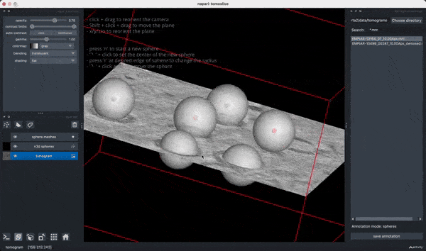

# napari-tomoslice

[](https://github.com/alisterburt/napari-tomoslice/raw/main/LICENSE)
[](https://pypi.org/project/napari-tomoslice)
[](https://python.org)
[](https://github.com/alisterburt/napari-tomoslice/actions/workflows/ci.yml)
[](https://codecov.io/gh/alisterburt/napari-tomoslice)

*napari-tomoslice* is a tool for tomogram visualisation and annotation in napari.

<p align="center">
  
  <br>
  <em>annotating spheres in napari-tomoslice</em>
</p>

*napari-tomoslice* is powered by
[*napari*](https://github.com/napari/napari) 
and
[*napari-threedee*](https://github.com/napari-threedee/napari-threedee).

## Features

*napari-tomoslice* allows you to quickly annotate

- points
- paths
- spheres

Annotations are saved in the [STAR file format](https://en.wikipedia.org/wiki/Self-defining_Text_Archive_and_Retrieval)
and can be easily manipulated in Python using [starfile](https://teamtomo.org/starfile/).

## Installation

*napari-tomoslice* is available on PyPI.

```shell
pip install napari-tomoslice
```

We recommend installing into a fresh conda environment.

*napari* does not work well via X forwarding. If you want to use *napari-tomoslice* in a HPC environment
please run via a virtual desktop solution.

## Usage

```sh
 Usage: napari-tomoslice [OPTIONS]                                                                                                                                              
                                                                                                                                                                                
╭─ Options ────────────────────────────────────────────────────────────────────────────────╮
│    --tomogram-directory          PATH                    [default: None]                 │
│    --file-pattern                TEXT                    [default: *.mrc]                │
│    --annotation-directory        PATH                    [default: 2024_05_22_21:16:44]  │
│ *  --mode                        [points|paths|spheres]  [required]                      │
│    --help                                                Show this message and exit.     │
╰──────────────────────────────────────────────────────────────────────────────────────────╯
````

## Inspiration

*napari-tomoslice* is inspired by [*dtmslice* in Dynamo](https://www.dynamo-em.org/w/index.php?title=Dtmslice).

