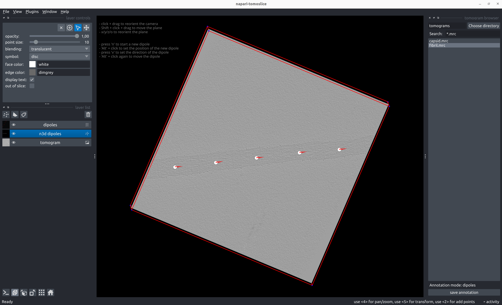
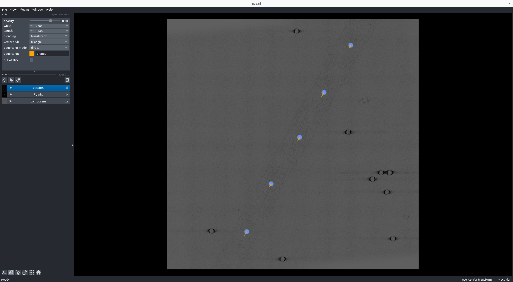
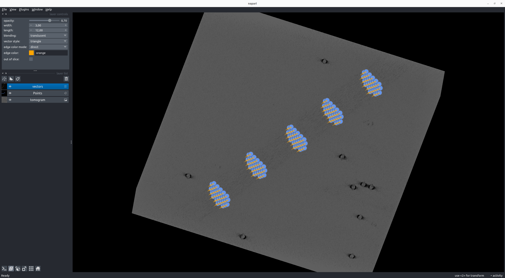

# Dipoles

## Annotate Dipoles

````
napari-tomoslice annotate --tomogram-directory tomograms/ --annotation-directory tomograms/annotations/ --mode dipoles
````

- Load a tomogram using the tomogram browser on the right panel
- Annotate dipoles:

    - Shift + click and drag to move the plane up/down  
    - Press 'x', 'y', 'z', or 'o' to reorient the plane  
    - Alt + click to position the center of the dipole  
    - Press 'v' to define the direction of the dipole vector  
    - Alt + click again to move/shift the dipole  
    - Press 'n' to start a new dipole  
    - To go back and change the position or direction vector of a previously added dipole:  
        - Select the dipole using 'Select points' from the Napari layer control panel on the left
        - Alt + click to move/shift the position of the dipole
        - 'v' to change the direction of the dipole
    - To move the plane during/after adding dipoles:  
        - Select the tomogram layer from the Napari layer list control panel on the left
        - Shift + click and drag to move the plane up/down

- Save dipole annotations with the 'save annotation' button on the right panel

  

??? note "Example dipole annotation STAR file"
    === "TS_01_dipoles.star"
        ```txt
        data_dipoles

        loop_
        _x #1
        _y #2
        _z #3
        _direction_x #4
        _direction_y #5
        _direction_z #6
        368.092987      62.774464       47.000000       -0.491499       0.870878        0.000000
        315.885254      156.151306      47.000000       -0.555069       0.831804        0.000000
        263.149506      249.084579      47.000000       -0.481098       0.876667        0.000000
        206.995789      347.166748      47.000000       -0.531959       0.846770        0.000000
        159.092438      439.703857      47.000000       -0.523566       0.851985        0.000000
        ```

## Generate Poses from Dipole Annotations

### Direct Dipole
````
 napari-tomoslice generate-poses  dipoles direct --annotations-directory tomograms/annotations/ --output-star-file tomograms/direct.star
````
  

??? note "Example direct poses STAR file for dipole annotation"
    === "direct.star"
        ```txt
        data_particles
        
        loop_
        _x #1
        _y #2
        _z #3
        _rot #4
        _tilt #5
        _psi #6
        _tilt_series_id #7
        368.092987      62.774464       47.000000       -90.000000      90.000000       60.560842       TS_01
        315.885254      156.151306      47.000000       -90.000000      90.000000       56.284523       TS_01
        263.149506      249.084579      47.000000       -90.000000      90.000000       61.242866       TS_01
        206.995789      347.166748      47.000000       -90.000000      90.000000       57.862084       TS_01
        159.092438      439.703857      47.000000       -90.000000      90.000000       58.428239       TS_01
        ```


### Disk Dipole
````
napari-tomoslice generate-poses dipoles disk --annotations-directory tomograms/annotations/ --output-star-file tomograms/disk.star --distance-between-particles 10 --disk-ra
dius 30
````
  

??? note "Example disk poses STAR file for dipole annotation"
    === "disk.star"
        ```txt
        data_particles
        
        loop_
        _x #1
        _y #2
        _z #3
        _rot #4
        _tilt #5
        _psi #6
        _tilt_series_id #7
        368.092987      62.774464       77.000000       -90.000000      90.000000       60.560842       TS_01
        355.029815      55.401978       68.339746       -90.000000      90.000000       60.560842       TS_01
        363.738596      60.316969       68.339746       -90.000000      90.000000       60.560842       TS_01
        372.447378      65.231959       68.339746       -90.000000      90.000000       60.560842       TS_01
        381.156159      70.146950       68.339746       -90.000000      90.000000       60.560842       TS_01
        350.675425      52.944483       59.679492       -90.000000      90.000000       60.560842       TS_01
        359.384206      57.859473       59.679492       -90.000000      90.000000       60.560842       TS_01
        368.092987      62.774464       59.679492       -90.000000      90.000000       60.560842       TS_01
        376.801768      67.689455       59.679492       -90.000000      90.000000       60.560842       TS_01
        ...
        ```

## Convert Poses into Relion 5 STAR files
````
napari-tomoslice export-poses --input-file tomograms/disk.star --output-type relion5 --output-file tomograms/disk-relion.star
````

??? note "Example Relion 5 STAR file for dipole annotation"
    === "disk-relion.star"
        ```txt
        data_particles
        
        loop_
        _rlnCoordinateX #1
        _rlnCoordinateY #2
        _rlnCoordinateZ #3
        _rlnAngleRot #4
        _rlnAngleTilt #5
        _rlnAnglePsi #6
        _rlnTomoName #7
        368.092987      62.774464       77.000000       -90.000000      90.000000       60.560842       TS_01
        355.029815      55.401978       68.339746       -90.000000      90.000000       60.560842       TS_01
        363.738596      60.316969       68.339746       -90.000000      90.000000       60.560842       TS_01
        372.447378      65.231959       68.339746       -90.000000      90.000000       60.560842       TS_01
        381.156159      70.146950       68.339746       -90.000000      90.000000       60.560842       TS_01
        350.675425      52.944483       59.679492       -90.000000      90.000000       60.560842       TS_01
        359.384206      57.859473       59.679492       -90.000000      90.000000       60.560842       TS_01
        368.092987      62.774464       59.679492       -90.000000      90.000000       60.560842       TS_01
        376.801768      67.689455       59.679492       -90.000000      90.000000       60.560842       TS_01
        ...
        ```
