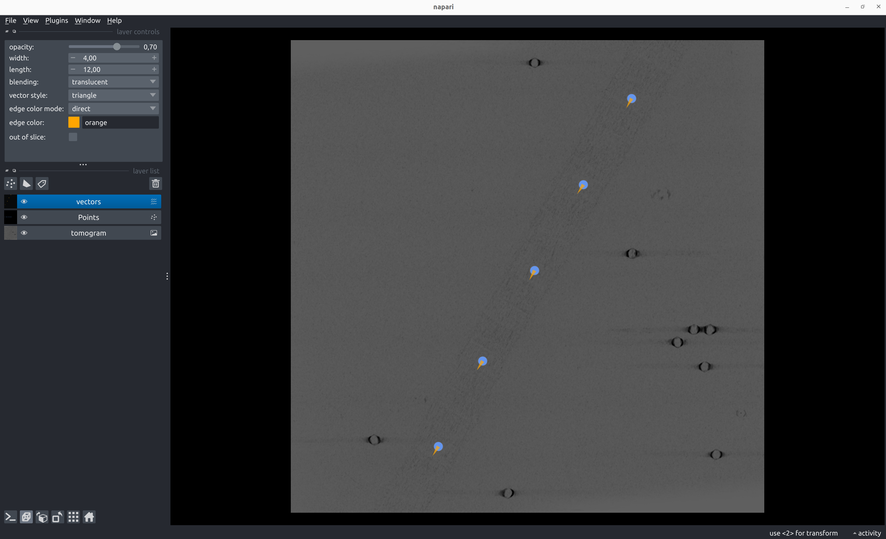
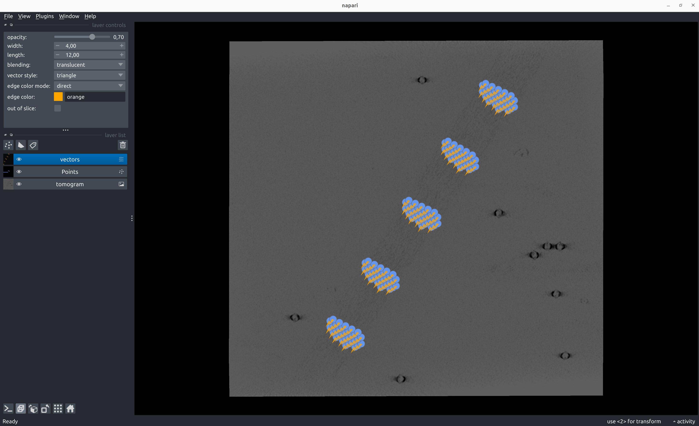

# Generate Poses 

Generate poses from geometrical annotations

    napari-tomoslice generate-poses [OPTIONS] COMMAND [ARGS]...   

Poses can be sampled in a number of ways from each annotation type:

- [Points](generate.md#points)
- [Spheres](generate.md#spheres)
- [Path](generate.md#paths): [Backbone](generate.md#backbone), [Helix](generate.md#helix), [Rings](generate.md#rings)
- [Dipoles](generate.md#dipoles): [Direct](generate.md#direct), [Disk](generate.md#disk)

## Points
````
 Usage: napari-tomoslice generate-poses points [OPTIONS]                                                                                                                                                                                         
                                                                                                                                                                                                                                                 
 generate particle poses from point annotations                                                                                                                                                                                                  
                                                                                                                                                                                                                                                 
╭─ Options ─────────────────────────────────────────────────────────────────────────────────────────────────────────────────────────────────────────────────────────────────────────────────────────────────────────────────────────────────────╮
│ *  --annotations-directory        PATH  [default: None] [required]                                                                                                                                                                            │
│ *  --output-star-file             PATH  [default: None] [required]                                                                                                                                                                            │
│    --help                               Show this message and exit.                                                                                                                                                                           │
╰───────────────────────────────────────────────────────────────────────────────────────────────────────────────────────────────────────────────────────────────────────────────────────────────────────────────────────────────────────────────╯
````
 

## Spheres
````
 Usage: napari-tomoslice generate-poses spheres [OPTIONS]                                                                                                                                                                                        
                                                                                                                                                                                                                                                 
 generate particle poses from sphere annotations                                                                                                                                                                                                 
                                                                                                                                                                                                                                                 
╭─ Options ─────────────────────────────────────────────────────────────────────────────────────────────────────────────────────────────────────────────────────────────────────────────────────────────────────────────────────────────────────╮
│ *  --annotations-directory             PATH   [default: None] [required]                                                                                                                                                                      │
│ *  --output-star-file                  PATH   [default: None] [required]                                                                                                                                                                      │
│ *  --distance-between-particles        FLOAT  [default: None] [required]                                                                                                                                                                      │
│    --help                                     Show this message and exit.                                                                                                                                                                     │
╰───────────────────────────────────────────────────────────────────────────────────────────────────────────────────────────────────────────────────────────────────────────────────────────────────────────────────────────────────────────────╯
````
 

## Paths

    napari-tomoslice generate-poses paths [OPTIONS] COMMAND [ARGS]...  

### Backbone
````
 Usage: napari-tomoslice generate-poses paths backbone [OPTIONS]                                                                                                                                                                                 
                                                                                                                                                                                                                                                 
 evenly spaced particle poses along the annotated path                                                                                                                                                                                           
                                                                                                                                                                                                                                                 
╭─ Options ─────────────────────────────────────────────────────────────────────────────────────────────────────────────────────────────────────────────────────────────────────────────────────────────────────────────────────────────────────╮
│ *  --annotations-directory             PATH   [default: None] [required]                                                                                                                                                                      │
│ *  --output-star-file                  PATH   [default: None] [required]                                                                                                                                                                      │
│ *  --distance-between-particles        FLOAT  [default: None] [required]                                                                                                                                                                      │
│    --help                                     Show this message and exit.                                                                                                                                                                     │
╰───────────────────────────────────────────────────────────────────────────────────────────────────────────────────────────────────────────────────────────────────────────────────────────────────────────────────────────────────────────────╯
````
 
### Helix
````
 Usage: napari-tomoslice generate-poses paths helix [OPTIONS]                                                                                                                                                                                    
                                                                                                                                                                                                                                                 
 evenly spaced particle poses along the annotated helical path                                                                                                                                                                                   
                                                                                                                                                                                                                                                 
╭─ Options ─────────────────────────────────────────────────────────────────────────────────────────────────────────────────────────────────────────────────────────────────────────────────────────────────────────────────────────────────────╮
│ *  --annotations-directory             PATH   [default: None] [required]                                                                                                                                                                      │
│ *  --output-star-file                  PATH   [default: None] [required]                                                                                                                                                                      │
│ *  --distance-between-particles        FLOAT  [default: None] [required]                                                                                                                                                                      │
│ *  --twist                             FLOAT  [default: None] [required]                                                                                                                                                                      │
│    --help                                     Show this message and exit.                                                                                                                                                                     │
╰───────────────────────────────────────────────────────────────────────────────────────────────────────────────────────────────────────────────────────────────────────────────────────────────────────────────────────────────────────────────╯
````


### Rings
````
 Usage: napari-tomoslice generate-poses paths rings [OPTIONS]                                                                                                                                                                                    
                                                                                                                                                                                                                                                 
 particle poses on evenly spaced rings along the annotated path                                                                                                                                                                                  
                                                                                                                                                                                                                                                 
╭─ Options ─────────────────────────────────────────────────────────────────────────────────────────────────────────────────────────────────────────────────────────────────────────────────────────────────────────────────────────────────────╮
│ *  --annotations-directory             PATH     [default: None] [required]                                                                                                                                                                    │
│ *  --output-star-file                  PATH     [default: None] [required]                                                                                                                                                                    │
│ *  --distance-between-particles        FLOAT    [default: None] [required]                                                                                                                                                                    │
│ *  --number-of-points-per-ring         INTEGER  [default: None] [required]                                                                                                                                                                    │
│ *  --ring-radius                       FLOAT    [default: None] [required]                                                                                                                                                                    │
│    --help                                       Show this message and exit.                                                                                                                                                                   │
╰───────────────────────────────────────────────────────────────────────────────────────────────────────────────────────────────────────────────────────────────────────────────────────────────────────────────────────────────────────────────╯
````
  

## Dipoles
    napari-tomoslice generate-poses dipoles [OPTIONS] COMMAND [ARGS]...   

### Direct
````
 Usage: napari-tomoslice generate-poses dipoles direct [OPTIONS]                                                                                                                                                                                 
                                                                                                                                                                                                                                                 
 particle poses directly from the annotated dipoles                                                                                                                                                                                              
                                                                                                                                                                                                                                                 
╭─ Options ─────────────────────────────────────────────────────────────────────────────────────────────────────────────────────────────────────────────────────────────────────────────────────────────────────────────────────────────────────╮
│ *  --annotations-directory        PATH  [default: None] [required]                                                                                                                                                                            │
│ *  --output-star-file             PATH  [default: None] [required]                                                                                                                                                                            │
│    --help                               Show this message and exit.                                                                                                                                                                           │
╰───────────────────────────────────────────────────────────────────────────────────────────────────────────────────────────────────────────────────────────────────────────────────────────────────────────────────────────────────────────────╯
````


### Disk
````
 Usage: napari-tomoslice generate-poses dipoles disk [OPTIONS]                                                                                                                                                                                   
                                                                                                                                                                                                                                                 
 particle poses on a disk around the annotated dipoles                                                                                                                                                                                           
                                                                                                                                                                                                                                                 
╭─ Options ─────────────────────────────────────────────────────────────────────────────────────────────────────────────────────────────────────────────────────────────────────────────────────────────────────────────────────────────────────╮
│ *  --annotations-directory             PATH   [default: None] [required]                                                                                                                                                                      │
│ *  --output-star-file                  PATH   [default: None] [required]                                                                                                                                                                      │
│ *  --distance-between-particles        FLOAT  [default: None] [required]                                                                                                                                                                      │
│ *  --disk-radius                       FLOAT  [default: None] [required]                                                                                                                                                                      │
│    --help                                     Show this message and exit.                                                                                                                                                                     │
╰───────────────────────────────────────────────────────────────────────────────────────────────────────────────────────────────────────────────────────────────────────────────────────────────────────────────────────────────────────────────╯
````
