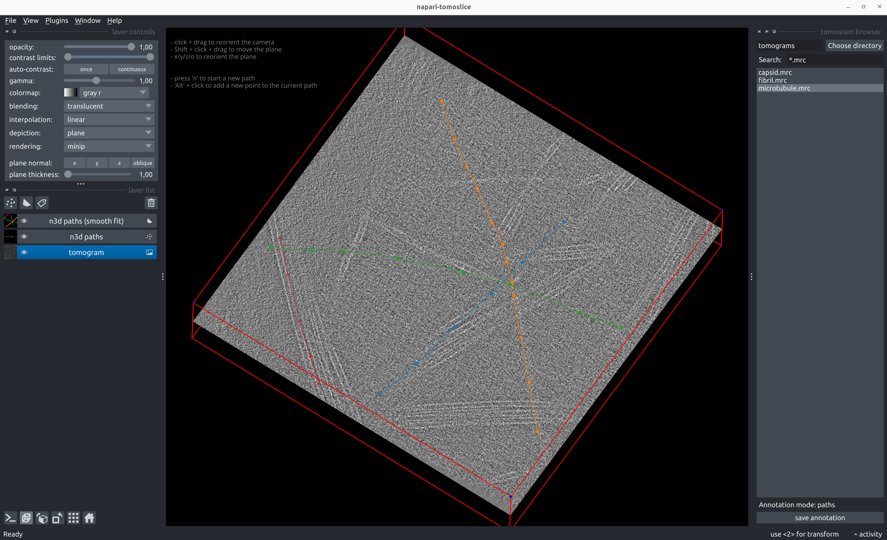
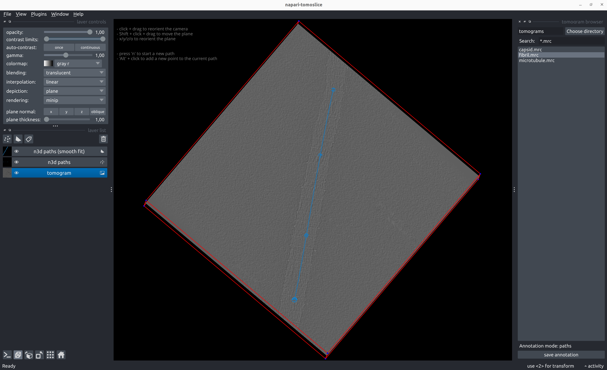
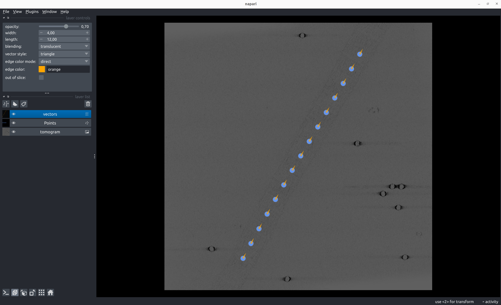
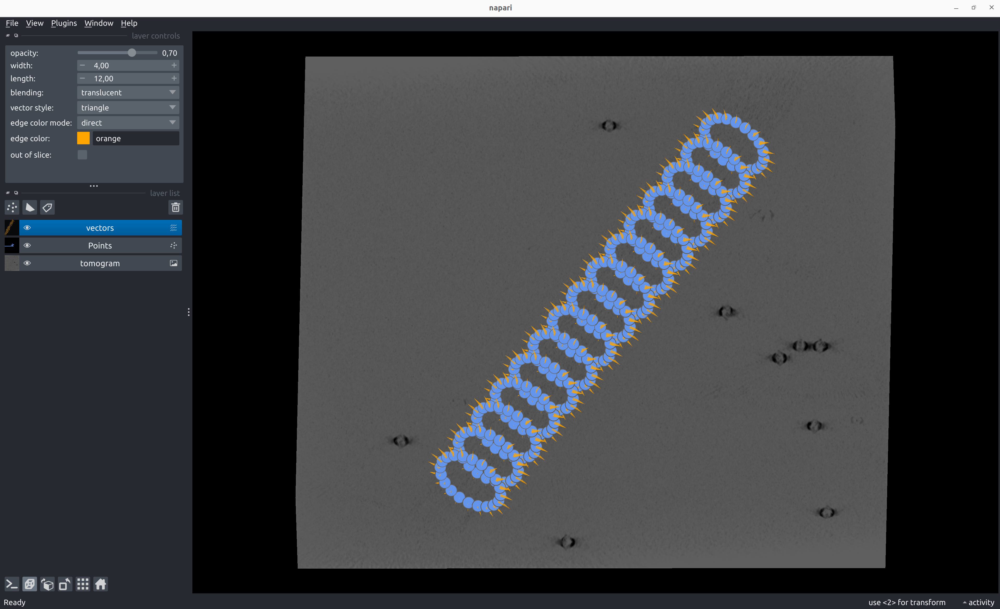

# Paths

## Annotate Paths

````
napari-tomoslice annotate --tomogram-directory tomograms/ --annotation-directory tomograms/annotations/ --mode paths
````

- Load a tomogram using the tomogram browser on the right panel
- Annotate paths:

    - Shift + click and drag to move the plane up/down  
    - Press 'x', 'y', 'z', or 'o' to reorient the plane  
    - Alt + click to add points to a path
    - Press 'n' to start a new path  
    - To go back and change the position of a previously added point on the path:  
        - Select the point using 'Select points' from the Napari layer control panel on the left
        - Click the new desired position of the selected point

- Save path annotations with the 'save annotation' button on the right panel

  
  

??? note "Example path annotation STAR file"
    === "TS_01_paths.star"
        ```txt
        data_paths
        
        loop_
        _path_id #1
        _x #2
        _y #3
        _z #4
        0       544.339600      87.541283       143.654221
        0       575.727539      216.720276      143.654221
        0       599.883362      364.465271      143.654221
        0       625.092346      502.951721      143.654221
        0       644.559998      625.716187      143.654221
        0       669.907593      788.138611      143.654221
        1       949.780212      241.041260      119.062782
        1       850.739319      349.160553      119.062782
        1       757.877319      447.972382      119.062782
        1       673.598145      540.173889      119.062782
        1       649.529968      569.203552      125.231110
        1       605.604736      606.439026      136.268234
        1       571.453613      638.566162      148.028320
        ...
        ```

## Generate Poses from Path Annotations

### Backbone
````
napari-tomoslice generate-poses paths backbone --annotations-directory tomograms/annotations/ --output-star-file tomograms/backbone.star --distance-between-particles 20
````

  
  

??? note "Example backbone poses STAR file for path annotation"
    === "backbone.star"
        ```txt
        data_particles
        
        loop_
        _x #1
        _y #2
        _z #3
        _rot #4
        _tilt #5
        _psi #6
        _manifold_id #7
        _tilt_series_id #8
        544.339600      87.541283       143.654221      83.906794       90.000000       108.077827      0       TS_01
        550.446462      107.202244      143.654221      83.906811       90.000000       106.456666      0       TS_01
        556.020058      127.021101      143.654221      83.906825       90.000000       104.983386      0       TS_01
        561.108958      146.970031      143.654221      83.906836       90.000000       103.664170      0       TS_01
        565.764856      167.024545      143.654221      83.906844       90.000000       102.503192      0       TS_01
        570.041693      187.163396      143.654221      83.906851       90.000000       101.503022      0       TS_01
        573.994933      207.368340      143.654221      83.906855       90.000000       100.665014      0       TS_01
        577.681008      227.623793      143.654221      83.906858       90.000000       99.989685       0       TS_01
        581.156911      247.916420      143.654221      83.906860       90.000000       99.477026       0       TS_01
        584.479922      268.234680      143.654221      83.906861       90.000000       99.126772       0       TS_01
        587.707440      288.568351      143.654221      83.906861       90.000000       98.938590       0       TS_01
        590.896888      308.908038      143.654221      83.906861       90.000000       98.912225       0       TS_01
        594.105678      329.244677      143.654221      83.906861       90.000000       99.047559       0       TS_01
        ...
        ```

### Helix
````
napari-tomoslice generate-poses paths helix --annotations-directory tomograms/annotations/ --output-star-file tomograms/helix.star --distance-between-particles 30 --twist 30
````

### Rings
````
napari-tomoslice generate-poses paths rings --annotations-directory tomograms/annotations/ --output-star-file tomograms/rings.star --distance-between-particles 30 --number-of-points-per-ring 20 --ring-radius 30
````

  

??? note "Example ring poses STAR file for path annotation"
    === "rings.star"
        ```txt
        data_particles
        
        loop_
        _x #1
        _y #2
        _z #3
        _rot #4
        _tilt #5
        _psi #6
        _manifold_id #7
        _tilt_series_id #8
        172.715260      462.534600      31.518678       -0.000000       121.067266      152.470202      0       TS_01
        187.601372      434.386138      31.518681       0.000000        121.067261      151.800465      0       TS_01
        202.812960      406.368763      31.518682       0.000000        121.067257      151.215781      0       TS_01
        218.307508      378.463004      31.518684       -0.000000       121.067255      150.716523      0       TS_01
        234.042799      350.648113      31.518685       0.000000        121.067253      150.302892      0       TS_01
        249.976910      322.902269      31.518685       0.000000        121.067252      149.974978      0       TS_01
        266.068179      295.202772      31.518685       -0.000000       121.067251      149.732799      0       TS_01
        282.275139      267.526232      31.518686       -0.000000       121.067251      149.576337      0       TS_01
        298.556435      239.848747      31.518686       -0.000000       121.067251      149.505567      0       TS_01
        ...
        ```

## Convert Poses into Relion 5 STAR files
````
napari-tomoslice export-poses --input-file tomograms/backbone.star --output-type relion5 --output-file tomograms/backbone-relion.star
````

??? note "Example Relion 5 STAR file for path annotation"
    === "backbone-relion.star"
        ```txt
        data_
        
        loop_
        _rlnCoordinateX #1
        _rlnCoordinateY #2
        _rlnCoordinateZ #3
        _rlnAngleRot #4
        _rlnAngleTilt #5
        _rlnAnglePsi #6
        _rlnTomoManifoldIndex #7
        _rlnTomoName #8
        544.339600      87.541283       143.654221      83.906794       90.000000       108.077827      0       TS_01
        550.446462      107.202244      143.654221      83.906811       90.000000       106.456666      0       TS_01
        556.020058      127.021101      143.654221      83.906825       90.000000       104.983386      0       TS_01
        561.108958      146.970031      143.654221      83.906836       90.000000       103.664170      0       TS_01
        565.764856      167.024545      143.654221      83.906844       90.000000       102.503192      0       TS_01
        570.041693      187.163396      143.654221      83.906851       90.000000       101.503022      0       TS_01
        573.994933      207.368340      143.654221      83.906855       90.000000       100.665014      0       TS_01
        577.681008      227.623793      143.654221      83.906858       90.000000       99.989685       0       TS_01
        581.156911      247.916420      143.654221      83.906860       90.000000       99.477026       0       TS_01
        584.479922      268.234680      143.654221      83.906861       90.000000       99.126772       0       TS_01
        587.707440      288.568351      143.654221      83.906861       90.000000       98.938590       0       TS_01
        590.896888      308.908038      143.654221      83.906861       90.000000       98.912225       0       TS_01
        594.105678      329.244677      143.654221      83.906861       90.000000       99.047559       0       TS_01
        597.391177      349.569046      143.654221      83.906861       90.000000       99.344633       0       TS_01
        ...
        ```
