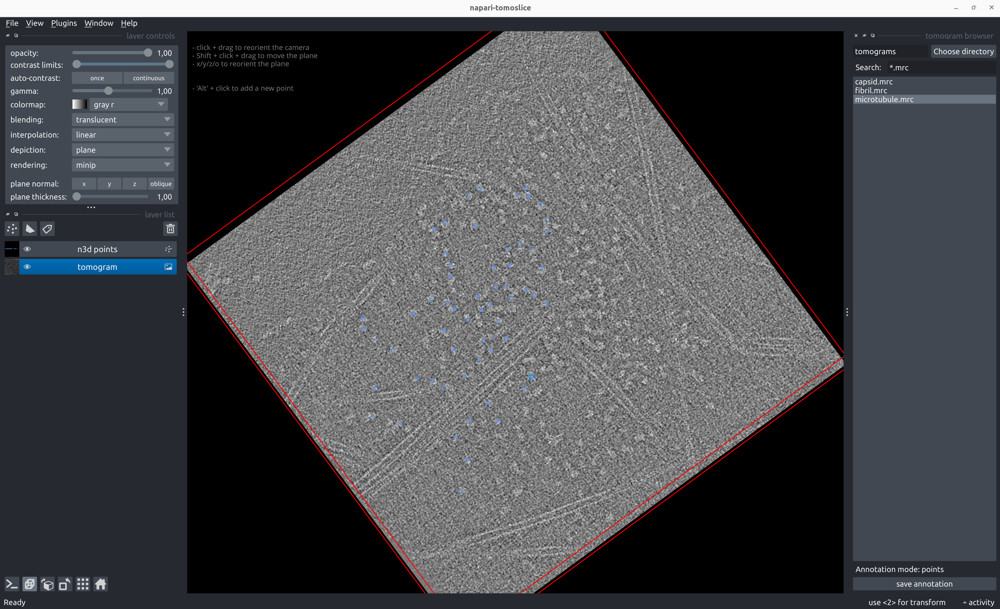

# Points

## Annotate Points
````
napari-tomoslice annotate --tomogram-directory tomograms/ --annotation-directory tomograms/annotations/ --mode points
````

- Load a tomogram using the tomogram browser on the right panel
- Annotate points:

    - Shift + click and drag to move the plane up/down  
    - Press 'x', 'y', 'z', or 'o' to reorient the plane  
    - Alt + click to position the points

- Save point annotations with the 'save annotation' button on the right panel

  

??? note "Example point annotation STAR file"
    === "TS_01_points.star"
        ```txt
        data_points
        
        loop_
        _x #1
        _y #2
        _z #3
        678.774568      341.384876      66.419179
        639.793559      352.615130      66.419179
        632.822507      398.760556      66.419179
        639.420122      463.065457      66.419179
        494.201621      365.134786      66.419179
        503.348605      477.571296      66.419179
        461.693747      477.486717      66.419179
        457.720446      459.715509      66.419179
        436.793306      478.880565      66.419179
        ...
        ```

## Generate Poses from Point Annotations
````
napari-tomoslice generate-poses points --annotations-directory tomograms/annotations/ --output-star-file tomograms/points.star
````
??? note "Example poses STAR file for point annotation"
    === "points.star"
        ```txt
        data_
        
        loop_
        _x #1
        _y #2
        _z #3
        _tilt_series_id #4
        678.774568      341.384876      66.419179       TS_01
        694.346706      407.600310      66.419179       TS_01
        704.173561      318.692324      66.419179       TS_01
        710.924732      241.589390      66.419179       TS_01
        713.456050      367.965992      66.419179       TS_01
        780.956540      411.036262      66.419179       TS_01
        742.811183      417.607369      66.419179       TS_01
        633.147579      523.881512      66.419179       TS_01
        599.696447      589.845587      66.419179       TS_01
        606.133068      632.562486      66.419179       TS_01
        ...
        ```

### Convert Poses into Relion 5 STAR files
````
napari-tomoslice export-poses --input-file tomograms/points.star --output-type relion5 --output-file tomograms/points-relion.star
````
??? note "Example Relion 5 STAR file for point annotation"
    === "points-relion.star"
        ```txt
        data_
        
        loop_
        _rlnCoordinateX #1
        _rlnCoordinateY #2
        _rlnCoordinateZ #3
        _rlnTomoName  #4
        678.774568      341.384876      66.419179       TS_01
        694.346706      407.600310      66.419179       TS_01
        704.173561      318.692324      66.419179       TS_01
        710.924732      241.589390      66.419179       TS_01
        713.456050      367.965992      66.419179       TS_01
        780.956540      411.036262      66.419179       TS_01
        742.811183      417.607369      66.419179       TS_01
        633.147579      523.881512      66.419179       TS_01
        599.696447      589.845587      66.419179       TS_01
        606.133068      632.562486      66.419179       TS_01
        ...
        ```