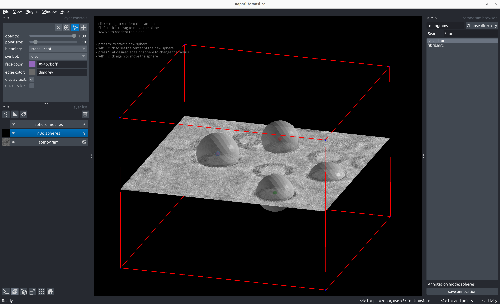
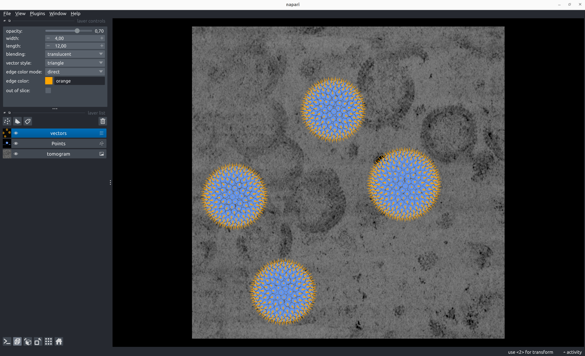

# Spheres

## Annotate Spheres
````
napari-tomoslice annotate --tomogram-directory tomograms/ --annotation-directory tomograms/annotations/ --mode spheres
````

- Load a tomogram using the tomogram browser on the right panel
- Annotate spheres:
  
    - Shift + click and drag to move the plane up/down  
    - Press 'x', 'y', 'z', or 'o' to reorient the plane  
    - Alt + click at the center of the sphere to define the center  
    - Press 'r' at the edge of the sphere to define the radius  
    - Alt + click again to move/shift the center of the sphere  
    - Press 'n' to start a new sphere  
    - To change the position or radius of a previously added sphere:  
        - Select the center of the sphere using 'Select points' from the Napari layer control panel on the left  
    - To move the plane during/after adding spheres:  
        - Select the tomogram layer from the Napari layer list control panel on the left  

- Save sphere annotations with the 'save annotation' button on the right panel

  

??? note "Example sphere annotation STAR file"
    === "TS_01_spheres.star"
        ```txt
        data_points

        loop_
        _x #1
        _y #2
        _z #3
        _radius #4
        72.788544       293.405701      196.252716      47.610168
        157.126236      458.723114      213.704895      47.610168
        243.421997      143.394058      234.561478      46.439350
        365.991516      272.661560      228.013626      53.870224
        ```


## Generate Poses from Sphere Annotations
````
napari-tomoslice generate-poses spheres --annotations-directory tomograms/annotations/ --output-star-file tomograms/spheres.star --distance-between-particles 10
````

 

??? note "Example poses STAR file for sphere annotation"
    === "spheres.star"
        ```txt
        data_
        
        loop_
        _x #1
        _y #2
        _z #3
        _rot #4
        _tilt #5
        _psi #6
        _tilt_series_id #7
        76.125785       293.405701      243.745778      164.508852      4.019451        179.999999      TS_01
        256.048907      171.247158      199.613242      -124.944668     138.812321      114.386664      TS_01
        214.949151      131.236965      199.947675      -17.199348      138.189603      -23.121101      TS_01
        272.977936      133.002502      200.282108      134.430350      137.574362      -160.628863     TS_01
        228.477031      171.340479      200.616540      39.587828       136.966266      61.863372       TS_01
        235.476528      112.348660      200.950973      124.534250      136.365006      -75.644392      TS_01
        270.542232      161.108716      201.285406      69.346477       135.770293      146.847844      TS_01
        211.122771      148.706462      201.619839      -26.714926      135.181854      9.340080        TS_01
        263.855845      117.397112      201.954272      -5.861923       134.599436      -128.167685     TS_01
        245.940018      176.691819      202.288705      121.067224      134.022798      94.324552       TS_01
        218.839633      120.323232      202.623138      -115.993090     133.451717      -43.183211      TS_01
        277.446075      143.804402      202.957571      -22.871847      132.885977      179.309024      TS_01
        217.827222      166.279440      203.292004      112.794377      132.325377      41.801261       TS_01
        246.865925      108.929935      203.626436      -159.417033     131.769732      -95.706505      TS_01
        264.339877      171.370088      203.960869      138.753360      131.218857      126.785731      TS_01
        208.815170      136.841246      204.295302      139.267877      130.672583      -10.722033      TS_01
        252.805706      114.694015      199.278809      178.921385      139.442871      -108.105573     TS_01
        273.608348      124.699454      204.629735      -6.134311       130.130750      -148.229798     TS_01
        ...
        ```


## Convert Poses into Relion 5 STAR files
````
napari-tomoslice convert-poses --input-file tomograms/spheres.star --output-type relion5 --output-file tomograms/spheres-relion.star
````
??? note "Example Relion 5 STAR file for sphere annotation"
    === "spheres-relion.star"
        ```txt
        data_
        
        loop_
        _rlnCoordinateX #1
        _rlnCoordinateY #2
        _rlnCoordinateZ #3
        _rlnAngleRot #4
        _rlnAngleTilt #5
        _rlnAnglePsi #6
        _rlnTomoName #7
        76.125785       293.405701      243.745778      164.508852      4.019451        179.999999      TS_01
        256.048907      171.247158      199.613242      -124.944668     138.812321      114.386664      TS_01
        214.949151      131.236965      199.947675      -17.199348      138.189603      -23.121101      TS_01
        272.977936      133.002502      200.282108      134.430350      137.574362      -160.628863     TS_01
        228.477031      171.340479      200.616540      39.587828       136.966266      61.863372       TS_01
        235.476528      112.348660      200.950973      124.534250      136.365006      -75.644392      TS_01
        270.542232      161.108716      201.285406      69.346477       135.770293      146.847844      TS_01
        211.122771      148.706462      201.619839      -26.714926      135.181854      9.340080        TS_01
        263.855845      117.397112      201.954272      -5.861923       134.599436      -128.167685     TS_01
        245.940018      176.691819      202.288705      121.067224      134.022798      94.324552       TS_01
        218.839633      120.323232      202.623138      -115.993090     133.451717      -43.183211      TS_01
        277.446075      143.804402      202.957571      -22.871847      132.885977      179.309024      TS_01
        217.827222      166.279440      203.292004      112.794377      132.325377      41.801261       TS_01
        246.865925      108.929935      203.626436      -159.417033     131.769732      -95.706505      TS_01
        264.339877      171.370088      203.960869      138.753360      131.218857      126.785731      TS_01
        208.815170      136.841246      204.295302      139.267877      130.672583      -10.722033      TS_01
        252.805706      114.694015      199.278809      178.921385      139.442871      -108.105573     TS_01
        273.608348      124.699454      204.629735      -6.134311       130.130750      -148.229798     TS_01
        ...
        ```